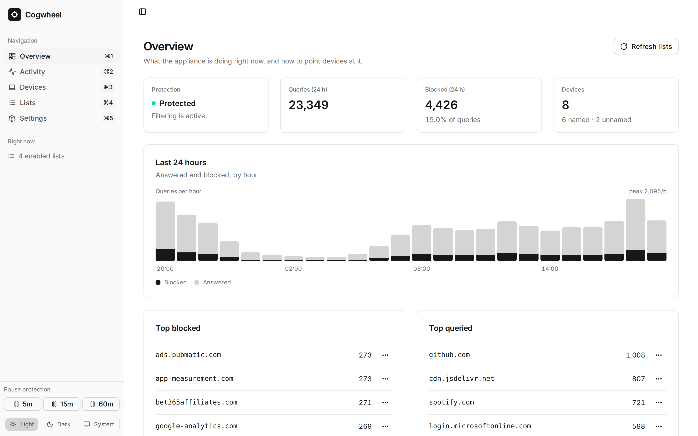
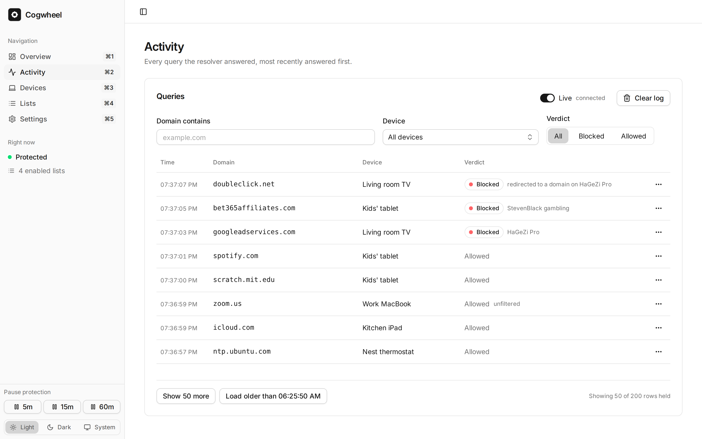

<div align="center">

<picture>
  <source media="(prefers-color-scheme: dark)" srcset="docs/assets/logo-paper.svg">
  
</picture>

# Cogwheel

**Network-wide ad and tracker blocking for every device in your home.**

A DNS filtering appliance written in Rust. Point your router at it and every device on the
network stops loading ads and trackers — including the ones that can never run a blocker
themselves.

[](https://github.com/thekozugroup/Cogwheel-DNS/actions/workflows/ci.yml)
[](LICENSE)

[Quick start](#quick-start) · [What it looks like](#what-it-looks-like) ·
[What it does](#what-it-does) · [Deployment](docs/DEPLOYMENT.md) ·
[Architecture](docs/ARCHITECTURE.md) · [Design](docs/DESIGN.md) · [Changelog](CHANGELOG.md)

</div>

---

## Why

The devices showing the most ads are the ones you cannot install a blocker on. The TV runs
whatever the manufacturer ships. The console has no extensions. The tablet the kids use has a
browser you did not choose, and the thermostat talks to an analytics endpoint you will never see
mentioned anywhere.

A browser extension stops at that browser. One resolver on the network is the only place a rule
applies to all of them at once, and the only place you can see what they are actually asking for.

That is the whole of what Cogwheel is for. It is not a firewall, not a threat feed and not a
router — see the
[scope boundary](docs/ARCHITECTURE.md#1-scope-boundary--what-cogwheel-is-not).

## Quick start

64-bit Linux (`x86_64` or `aarch64`), Docker with the Compose plugin, and root — binding port 53
needs it. On a Raspberry Pi, use the 64-bit OS.

> **Before the first release.** Nothing has been tagged yet and no image has been pushed to
> `ghcr.io/thekozugroup/cogwheel-dns`, so the one-line installer below fails on the pull and puts
> the host back the way it found it. Until `v0.1.0` exists, use the clone path — the **"Or from
> a clone"** block below, or
> [docs/QUICKSTART.md](docs/QUICKSTART.md#build-it-yourself-until-v010-is-tagged) — which builds
> the image locally and works today.

```sh
curl -fsSL https://raw.githubusercontent.com/thekozugroup/Cogwheel-DNS/main/scripts/install.sh | sudo sh
```

Open the address it prints, then set your router's DNS server to the same address. Every device
picks it up as its DHCP lease renews; reboot one to hurry it along.

Piping a script off the internet into root is a reasonable thing to be uneasy about, so download
it first and read it. `--print-compose` needs no root — it reads nothing and writes nothing, and
prints the exact deployment the real run would write:

```sh
curl -fsSL https://raw.githubusercontent.com/thekozugroup/Cogwheel-DNS/main/scripts/install.sh -o install.sh
less install.sh
sh install.sh --print-compose      # no root, no changes
sudo sh install.sh                 # the same script, now that you have read it
```

[`scripts/install.sh`](scripts/install.sh) checks Docker and the architecture, finds whatever
already owns port 53 and deals with it — for systemd-resolved's stub listener, the usual culprit,
it disables the stub _and_ repairs `/etc/resolv.conf` so the host can still resolve — then writes
`/etc/cogwheel/docker-compose.yml` and `/etc/cogwheel/.env`, waits for the container to report
healthy, and sends a real query through the resolver before telling you it worked. If any of that
fails it puts the host back the way it found it. Nothing outside `/etc/cogwheel` and the named
volume is touched, and everything it does change is recorded so `--uninstall` can reverse exactly
that and nothing else. `--help` lists the options.

<details>
<summary>Or from a clone — needed until the first release is published, and for building it yourself</summary>

```sh
git clone https://github.com/thekozugroup/Cogwheel-DNS.git
cd Cogwheel-DNS
cp .env.example .env                # optional: upstreams, block mode, retention

docker build -t cogwheel-dns:dev .
COGWHEEL_IMAGE=cogwheel-dns:dev docker compose up -d
```

The build compiles the Rust binary and the web UI from source, so the first one takes a while:
roughly 10 minutes on a four-core x86_64 machine and 30–60 on a Raspberry Pi 5, as an estimate.
`docker-compose.yml` has no `build:` section on purpose: with both `image:` and `build:` present,
Compose silently builds whenever the image is missing, which on a Raspberry Pi turns a failed
pull into a forty-minute surprise.

The one-line installer pulls `ghcr.io/thekozugroup/cogwheel-dns:latest`, which the
[release workflow](.github/workflows/release.yml) publishes on a version tag. Before that tag
exists, use this path.

</details>

**On Unraid**, put the template on the flash drive from the Unraid terminal, then pick
**cogwheel** under Docker → **Add Container** → **Template** — that list reads files on the flash
drive and does not take a URL:

```sh
mkdir -p /boot/config/plugins/dockerMan/templates-user
curl -fsSL -o /boot/config/plugins/dockerMan/templates-user/my-cogwheel.xml \
  https://raw.githubusercontent.com/thekozugroup/Cogwheel-DNS/main/deploy/unraid/cogwheel.xml
```

Everything else is filled in for you, including `--cap-add NET_BIND_SERVICE`, without which the
image does not start at all. The database goes in a named volume; to keep it in
`/mnt/user/appdata/cogwheel` instead, `chown -R 10001:10001` that folder first, because Cogwheel
runs as uid 10001. Use host networking or a custom `br0` address, never plain bridge — under
bridge, client IPs are rewritten to the Docker gateway and every device in the house looks like
one client. Until `v0.1.0` there is no image for the template to pull, and the clone path above
needs Compose, which Unraid does not ship; [docs/QUICKSTART.md](docs/QUICKSTART.md#unraid) has
the walkthrough, the build that works there today, and how to verify the install from Unraid's
terminal.

Either way it is one container and one volume. The binary serves the web UI from the same origin
it serves the API on, so there is no reverse proxy to configure and no CORS policy to get wrong.

[docs/QUICKSTART.md](docs/QUICKSTART.md) walks the same install through end to end, per host —
Linux, Raspberry Pi, Unraid, Compose from a clone, or no Docker at all — plus what to do in the
first five minutes after it is running.

Upgrading depends on the install: `docker compose pull && docker compose up -d` in the directory
holding the compose file, **Apply Update** in Unraid's Docker tab, or `git pull` and a re-run of
`install-native.sh` without Docker. Cogwheel never checks for updates on its own — the first
thing a privacy appliance should not do is phone home.
[DEPLOYMENT.md](docs/DEPLOYMENT.md#10-upgrades-and-rollback) covers all five paths, how to ask
whether there is anything newer, rollback and backup; its
[troubleshooting section](docs/DEPLOYMENT.md#8-troubleshooting) is organised by symptom.

> **The control plane has no authentication, and the box sees every name your household
> resolves.** Both are deliberate and both have consequences — read [SECURITY.md](SECURITY.md)
> before putting an instance anywhere but a home LAN.

## What it looks like



What the appliance is doing right now, and the address to give your router. The 24-hour chart
stacks blocked under answered rather than putting them side by side, because the question people
actually have is what share of the traffic was junk.



Every lookup as it happens, with the device that asked. A blocked row names the list that decided
— and where a tracker hid behind a first-party alias, it says _redirected to a domain on_ that
list instead, because the name in the query was not the name that was blocked. The row menu
allows a domain for everyone or for just that one device, and a rule you write outranks every
list.

## What it does

### Lists, rules and devices

Three things, matching the sidebar:

**Lists** are subscribed blocklists, fetched daily and compiled into an in-memory index. Eleven
presets ship in the picker — oisd, HaGeZi, StevenBlack — and any other list URL works as well.
Bodies are cached to disk, so a box that boots before its internet connection comes up still
filters.

**Rules** are one domain you allowed or blocked yourself, for the whole household or for one
device. This is how you fix a list that got something wrong.

**Devices** are a name for an address, each with its own filtering switch, list selection, rules
and counts.

When a query arrives, these are applied in order, and the first tier that matches decides:

| #   | Tier                  | Who sets it                                        |
| --- | --------------------- | -------------------------------------------------- |
| 1   | Filtering is off      | You — protection paused, or a device set to bypass |
| 2   | Device rule           | You                                                |
| 3   | Household rule        | You                                                |
| 4   | Protected set         | Cogwheel — 21 suffixes, not editable               |
| 5   | List exception (`@@`) | A subscribed list                                  |
| 6   | List block            | A subscribed list                                  |
| 7   | Allowed               | Nothing matched                                    |

Inside any one tier, an allow beats a block. Everything a list can do sits below everything you
can do, which is the property that turns a broken site into two clicks on the Activity row.

### Protected names no list can take down

Twenty-one domain suffixes are never blocked by a subscribed list: resolver bootstrap and
captive-portal checks, NTP, and the certificate-status endpoints of the major CAs. These are the
ones where blocking does not look like _the ad blocker broke this site_ — it looks like the
device is broken. A drifted clock fails TLS on everything at once and points nowhere near DNS.

Protection is applied when a query is evaluated, not when a list is parsed. A list containing
`pool.ntp.org` is still accepted and still useful; the names it hit are recorded against it and
stay reachable. Your own rules still outrank even this, because a rule is a choice somebody made
on purpose and a list entry covering NTP is almost always an accident upstream.

### Every lookup, and which device asked

The query log holds one row per lookup: the time, the client, the name, whether it was blocked
and which tier decided. Activity streams it live and filters it by domain, device and verdict.

It is kept for **7 days or 250,000 rows**, whichever comes first.
`COGWHEEL_RETENTION__HISTORY_DAYS=0` switches the raw log off entirely and keeps only the hourly
per-device counts, which are numbers rather than browsing history.

### Per-device policy

Name an address and it gets its own filtering switch, its own selection of lists, and its own
allow and block rules. The kids' tablet and the work laptop do not have to share a policy.

The honest limit on that: Cogwheel can only filter a query it is sent. A smart TV with a
hardcoded resolver, or a browser doing DNS-over-HTTPS on its own, never asks — so it is never
filtered and never appears in the log either. Per-device control and a device that ignores the
network entirely are two halves of the same sentence, and the Activity page is how you find out
which you have.

### Encrypted upstream

Plain UDP to `1.1.1.1` and `1.0.0.1` by default. DNS-over-TLS or DNS-over-HTTPS is one variable:

```sh
COGWHEEL_UPSTREAM__SERVERS=tls://1.1.1.1#cloudflare-dns.com,tls://1.0.0.1#cloudflare-dns.com
```

The name after `#` is not decoration — it is what the upstream's certificate is checked against,
and the trust anchors are compiled into the binary so an appliance with no system certificate
store still validates it.

Cogwheel is a DoT/DoH **client**, not a validating resolver: it can prove it is talking to the
upstream you named, and relies on that upstream to have validated the answer. It does not check
DNSSEC signatures itself.

### What it costs to run

Measured on a 4-vCPU x86_64 sandbox against a 56,000-entry list. These are reference points, not
Raspberry Pi figures — no Pi 5 measurement exists yet.

| Measurement                                                | Value               |
| ---------------------------------------------------------- | ------------------- |
| Binary, stripped                                           | 11 MB               |
| Resident memory, settled after a boot from cached lists    | ~17 MB              |
| Resident memory, peak while adding a list to a live policy | ~30 MB              |
| Cache hit, server-internal                                 | ~2.3 µs             |
| Throughput, four workers                                   | ~64,000 queries/sec |

Both memory figures are here because quoting either alone invites the wrong reading: the first is
what the appliance sits at, the second is what it has to survive. §12 of
[the spec](docs/spec-dnsnet-plus-four.md) carries the method that has to travel with them.

## Configuration

Everything is an environment variable — in `/etc/cogwheel/.env` after the one-line installer,
`.env` for Compose from a clone, `/etc/cogwheel/cogwheel.env` for a native install, or the
_Variables_ section of the Unraid template. See [`.env.example`](.env.example) for the annotated
set. The ones people actually change:

| Variable                                  | Default                    | Notes                                                                                                                      |
| ----------------------------------------- | -------------------------- | -------------------------------------------------------------------------------------------------------------------------- |
| `COGWHEEL_IMAGE`                          | `…/cogwheel-dns:latest`    | A moving tag is what makes `docker compose pull` an upgrade. Pin it to opt out, knowing nobody will tell you about a fix.  |
| `COGWHEEL_UPSTREAM__SERVERS`              | `1.1.1.1:53,1.0.0.1:53`    | Where unblocked queries go. `tls://ip#name` for DoT, `https://ip#name/path` for DoH.                                       |
| `COGWHEEL_BLOCKING__MODE`                 | `null_ip`                  | How a blocked name is answered: `null_ip`, `nxdomain`, `nodata` or `refused`.                                              |
| `COGWHEEL_RETENTION__HISTORY_DAYS`        | `7`                        | How long the query log is kept. **`0` stops logging lookups entirely** while keeping the hourly counts.                    |
| `COGWHEEL_RETENTION__QUERY_LOG_MAX_ROWS`  | `250000`                   | Hard ceiling on the log, whichever limit is reached first.                                                                 |
| `COGWHEEL_UPDATER__REFRESH_INTERVAL_SECS` | `86400`                    | How often lists are re-fetched. Floored at 300 — it is somebody else's server. A failing list retries every five minutes.  |
| `COGWHEEL_SERVER__ADVERTISED_DNS_TARGETS` | auto-detected              | The address the UI tells you to give your router. Set it when the box has several and it picks the wrong one.              |
| `COGWHEEL_SERVER__HTTP_BIND_ADDR`         | `0.0.0.0:8080`             | `127.0.0.1:8080` puts the control plane behind a reverse proxy instead. See [SECURITY.md](SECURITY.md).                    |

Those are the defaults the image and the shipped Compose file give you. A variable that is set
but cannot be parsed stops startup rather than falling back to something nobody chose, and
changing any of them needs a container restart.

## Development

```sh
sh scripts/verify.sh          # the whole gate: fmt, clippy, test, release build,
                              # audit, deny, web lint, web build, shellcheck, Dockerfile
```

That is the same set CI runs, in the same order, and `--list` prints it without running
anything. `cargo audit` and `cargo deny` install once with
`cargo install cargo-audit --locked` and `cargo install cargo-deny --locked`; anything not
installed is reported as skipped rather than counted as a pass.
[CONTRIBUTING.md](CONTRIBUTING.md) explains the three flags that are the difference between a
green local run and a red CI.

The toolchain is pinned in `rust-toolchain.toml`, so `rustup` fetches the right one on first
build. **The test suite needs no Docker daemon, no root and no route to the internet** — nothing
in it binds a privileged port or reaches a real host, which is why it runs anywhere.

To run the server locally, `COGWHEEL_PROFILE=dev` binds `127.0.0.1:30080` and `127.0.0.1:30053`
— loopback high ports that need no privileges and cannot collide with an appliance already
running on the same machine:

```sh
COGWHEEL_PROFILE=dev cargo run -p cogwheel-server

dig @127.0.0.1 -p 30053 example.com +short          # forwarded and cached
dig @127.0.0.1 -p 30053 doubleclick.net +short      # 0.0.0.0, once a list has downloaded
```

A household rule takes effect the moment you add it. The seeded list has to finish downloading
first, so on a fresh database the second command is only interesting after the Lists page says so.

Under the hood: Axum and Hickory DNS on the Rust side, with a wire-answer cache keyed by scope and
query type and SQLite through rusqlite. React 19, Vite, TypeScript, [Shark UI](https://shark.vini.one/),
Tailwind CSS v4 and self-hosted Inter on the web side — no CDN requests, because the appliance may
sit on a LAN with no internet route. Images are published for `linux/amd64` and `linux/arm64`.

Benchmarks come from a stdlib-only Python harness with no dependencies of its own — see
[scripts/bench/README.md](scripts/bench/README.md).

## Project layout

```
crates/cogwheel-policy     The rule representation and the precedence order. No I/O, no clock,
                           no dependency but serde — which is why the product's central
                           contract can be unit-tested without a resolver anywhere near it
crates/cogwheel-lists      Fetching, parsing and verifying blocklists, and compiling them into
                           the index the policy crate matches against
crates/cogwheel-dns-core   The resolver: listeners, the upstream client, and the wire-answer
                           cache that keeps a hit to microseconds
crates/cogwheel-storage    SQLite, the schema, and the migration that takes a snapshot before
                           it rewrites anything
apps/cogwheel-server       The composition root: HTTP, the query log writer, the refresh
                           scheduler. The only member allowed to depend on all four crates
apps/cogwheel-web          The five-page control plane, served by the binary above
deploy/                    The systemd unit, and the Unraid Docker template with its icon
docs/                      Quick start, using it, architecture, design contract, deployment,
                           releasing, the spec every route and precedence rule is checked
                           against, and the ADRs
scripts/                   The installer, the verification gate, the post-install and update
                           checks, and the benchmark harness
```

Dependencies flow one way and [a test](apps/cogwheel-server/src/tests/mod.rs) fails the build
when they do not: `cogwheel-lists` and `cogwheel-dns-core` may reach `cogwheel-policy`,
`cogwheel-storage` reaches nothing, and `cogwheel-policy` knows about none of them.

## Contributing

Issues and pull requests welcome — see [CONTRIBUTING.md](CONTRIBUTING.md). `sh scripts/verify.sh`
must pass.

The most likely useful contribution is not Rust: a blocklist preset, or a section of
[DEPLOYMENT.md](docs/DEPLOYMENT.md) covering a platform you have actually installed this on. Both
are data or prose.

Security issues go through [SECURITY.md](SECURITY.md), never a public issue.

## License

MIT © The Kozu Group
